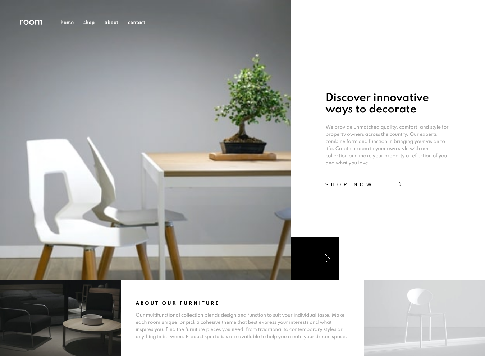

# Frontend Mentor - Room homepage solution

This is a solution to the [Room homepage challenge on Frontend Mentor](https://www.frontendmentor.io/challenges/room-homepage-BtdBY_ENq). Frontend Mentor challenges help you improve your coding skills by building realistic projects. 

## Table of contents

- [Overview](#overview)
  - [The challenge](#the-challenge)
  - [Screenshot](#screenshot)
  - [Links](#links)
- [My process](#my-process)
  - [Built with](#built-with)
  - [What I learned](#what-i-learned)
  - [Challenges](#challenges)
  - [Continued development](#continued-development)
  - [Useful resources](#useful-resources)
- [Author](#author)

## Overview

### The challenge

Users should be able to:

- View the optimal layout for the site depending on their device's screen size
- See hover states for all interactive elements on the page
- Navigate the slider using either their mouse/trackpad or keyboard

### Screenshot

### Links

- Solution URL: https://github.com/dstrickl7/Room-Homepage
- Live Site URL: https://dstrickl7.github.io/Room-Homepage

## My process

### Built with

- Semantic HTML5 markup
- SCSS
- Flexbox
- CSS Grid
- Mobile-first workflow
- Javascript

### What I learned

classList.toggle and solidifying my abilities using flex and CSS Grid. Learning to use classList.toggle will be invaluable in the future because it allows me to 

### Challenges

The changing content was the most challenging aspect of this project for me because I wasn't sure what to do or where to start. I figured I wasn't ready for this challenge yet and decided to focus on a project of lower difficulty. During that time I came up with some ideas of how to approach the rotating content. I decided to use a combination of CSS and Javascript to display the images and text. For the text I decided to use the toggle feature paired with looping through an array and for the images I looped through an array. Once I decided on this approach, my next struggle was properly toggling the content. Once I worked out the logic, everything fell into place.

### Continued development

I still feel like I don't have the strongest grasp on flexbox or grid and feel like I only have a basic understanding of it. I would like to develop that further. I also would like to continue using SASS. After learning it for my last project, I've fallen in love with it. The modules, the variables, the mixins just make everything so easy to organize and work with.

### Useful resources

- Traversy Media - I learned about toggle.classList from one of his tutorials.
- MDN Web Docs - My go-to resource for all things syntax 

## Author

- Frontend Mentor - [@dstrickl7](https://www.frontendmentor.io/profile/dstrickl7)
- Codepen - [@dstrickl7](https://codepen.io/dstrickl7)
- Github - [dstrickl7](https://github.com/dstrickl7)